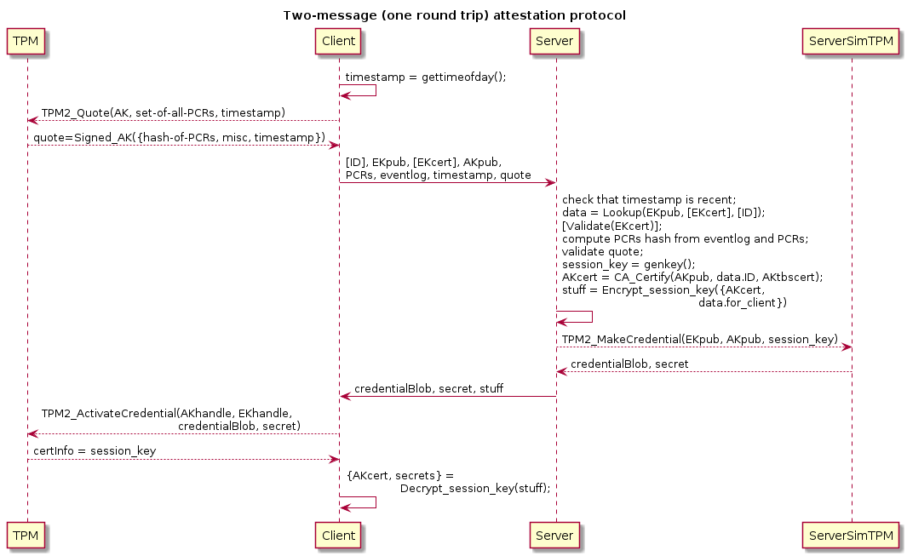
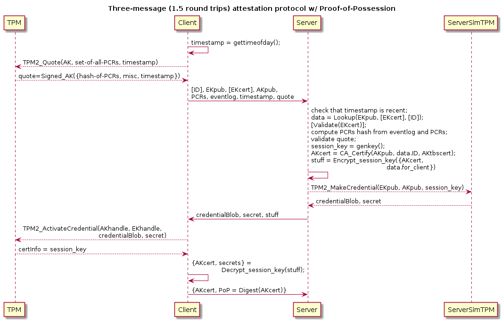
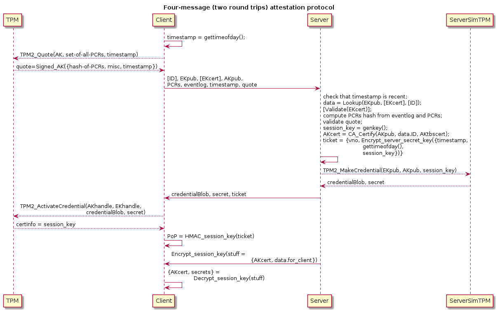

# What Attestation is

A computer can use a TPM to demonstrate:

 - possession of a valid TPM

 - it being in a trusted state by dint of having executed trusted code
   to get to that state

 - possession of objects such as asymmetric keypairs being resident on
   the TPM (objects that might be used in the attestation protocol)

Possible outputs of succesful attestation:

 - authorize client to join its network

 - delivery of configuration metadata to the client

 - unlocking of storage / filesystems on the client

 - delivery of various secrets, such credentials for various authentication systems:

    - issuance of X.509 certificate(s) for TPM-resident attestaion
      public keys

      For servers these certificates would have `dNSName` subject
      alternative names (SANs).

      For a user device such a certificate might have a subject name
      and/or SANs identifying the user or device.

    - issuance of non-PKIX certificates (e.g., OpenSSH-style certificates)

    - issuance of Kerberos host-based service principal long-term keys
      ("keytabs")

    - service account tokens

    - etc.

 - client state tracking

 - etc.

Possible outputs of unsuccessful attestation:

 - alerting

 - diagnostics (e.g., which PCR extensions in the PCR quote and eventlog
   are not recognized, which then might be used to determine what
   firmware / OS updates a client has installed, or that it has been
   compromised)

In this tutorial we'll focus on attestion of servers in an enterprise
environment.  However, the concepts described here are applicable to
other environments, such as IoTs and personal devices, where the
attestation database could be hosted on a user's personal devices for
use in joining new devices to the user's set of devices, or for joining
new IoTs to the user's SOHO network.

# Attestation Protocols

Attestation is done by a client computer with a TPM interacting with an
attestation service over a network.  This requires a network protocol
for attestation.

## Notation

 - `Encrypt_<name>` == encryption with the named private or secret key
   (if symmetric, then this primitive is expected to provide
   authenticated encryption).
 - `Sign_<name>` == digital signature with the named private key.
 - `MAC_<name>` == message authentication code keyed with the named
   secret key.
 - `CSn` == client-to-server message number `n`
 - `SCn` == server-to-client message number `n`
 - `{stuff, more_stuff}` == a sequence of data, a "struct"
 - `{"key":<value>,...}` == JSON text
 - `TPM2_MakeCredential(<args>)` == outputs of calling `TPM2_MakeCredential()` with `args` arguments
 - `TPM2_Certify(<args>)` == outputs of calling `TPM2_Certify()` with `args` arguments

## Proof of Possession of TPM

Proof of possession of a valid TPM is performed by the attestation
client sending its TPM's Endorsement Key (EK) certificate (if one is
available, else the attestation service must recognize the EK public
key) and then exchanging additional messages by which the client can
prove its possession of the EK.

Proof of possession of an EK is complicated by the fact that EKs are
[generally decrypt-only](Decrypt-only-EK.md) (some TPMs also support
signing EKs, but the TCG specifications only require decrypt-only EKs).
The protocol has to have the attestation service send a challenge (or
key) encrypted to the EKpub and then the attestation client demonstrate
that it was able to decrypt that with the EK.  However, this is not
_quite_ how attestation protocols work!  Instead of plain asymmetric
encryption the server will use
[`TPM2_MakeCredential()`](TPM2_MakeCredential.md), while the attestation
client will use
[`TPM2_ActivateCredential()`](TPM2_ActivateCredential.md) instead of
plain asymmetric decryption.

## Trusted State Attestation

Trusted state is attested by sending a quote of Platform Configuration
Registers (PCRs) and the `eventlog` describing the evolution of the
system's state from power-up to the current state.  The attestation
service validates the digests used to extend the various PCRs,
and perhaps the sequence in which they appear in the eventlog, typically
by checking a list of known-trusted digests (these are, for example,
checksums of firmware images).

Typically the attestation protocol will have the client generate a
signing-only asymmetric public key pair known as the attestation key
(AK) with which to sign the PCR quote and eventlog.  Binding of the
EKpub and AKpub will happen via
[`TPM2_MakeCredential()`](TPM2_MakeCredential.md) /
[`TPM2_ActivateCredential()`](TPM2_ActivateCredential.md).

Note that the [`TPM2_Quote()`](TPM2_Quote.md) function produces a signed
message -- signed with a TPM-resident AK named by the caller (and to
which they have access), which would be the AK used in the attestation
protocol.

The output of [`TPM2_Quote()`](TPM2_Quote.md) might be the only part of
a client's messages to the attestation service that include a signature
made with the AK, but integrity protection of everything else can be
implied (e.g., the eventlog and PCR values are used to reconstruct the
PCR digest signed in the quote).  `TPM2_Quote()` signs more than just a
digest of the selected PCRs.  `TPM2_Quote()` signs all of:

 - digest of selected PCRs
 - caller-provided extra data (e.g., a cookie/nonce/timestamp/...),
 - the TPM's firmware version number,
 - `clock` (the TPM's time since startup),
 - `resetCount` (an indirect indicator of reboots),
 - `restartCount` (an indirect indicator of suspend/resume events)
 - and `safe` (a boolean indicating whether the `clock` might have ever
   gone backwards).

## Binding of Other Keys to EKpub

The semantics of [`TPM2_MakeCredential()`](TPM2_MakeCredential.md) /
[`TPM2_ActivateCredential()`](TPM2_ActivateCredential.md) make it
possible to bind a TPM-resident object to the TPM's EKpub.

[`TPM2_MakeCredential()`](TPM2_MakeCredential.md) encrypts to the EKpub
a small secret datum and the name (digest of public part) of the
TPM-resident object being bound.  The counter-part to this,
[`TPM2_ActivateCredential()`](TPM2_ActivateCredential.md), will decrypt
that and return the secret to the application IFF (if and only if) the
caller has access to the named object.

Typically attestation protocols have the client send its EKpub, EKcert
(if it has one), AKpub (the public key of an "attestation key"), and
other things (e.g., PCR quote and eventlog signed with the AK), and the
server will then send the output of `TPM2_MakeCredential()` that the
client can recover a secret from using `TPM2_ActivateCredential()`.

The implication is that if the client can extract the cleartext payload
of `TPM2_MakeCredential()`, then it must possess a) the EK private key
corresponding to the EKpub, b) the AK private key corresponding to the
object named by the server.

Proof of possession can be completed immediately by demonstrating
knowledge of the secret sent by the server.  Proof of possession can
also be delayed to an eventual use of that secret, allowing for single
round trip attestation.

## Binding hosts to TPMs

(TBD.  Talk about IDevID or similar certificates binding hosts to their
factory-installed TPMs, and how to obtain those from vendors.)

## Attestation Protocol Patterns and Actual Protocols (decrypt-only EKs)

Note: all the protocols described below are based on decrypt-only TPM
endorsement keys.

Let's start with few observations and security considerations:

 - Clients need to know which PCRs to quote.  E.g., the [Safe Boot](https://safeboot.dev/)
   project and the [IBM sample attestation client and server](https://sourceforge.net/projects/ibmtpm20acs/)
   have the client ask for a list of PCRs and then the client quotes
   just those.

   But clients could just quote all PCRs.  It's more data to send, but
   probably not a big deal, and it saves a round trip if there's no need
   to ask what PCRs to send.

 - Some replay protection or freshness indication for client requests is
   needed.  A stateful method of doing this is to use a server-generated
   nonce (as an encrypted state cookie embedding a timestamp).  A
   stateless method is to use a timestamp and reject requests with old
   timestamps.

 - Replay protection of server to client responses is mostly either not
   needed or implicitly provided by [`TPM2_MakeCredential()`](TMP2_MakeCredential.md)
   because `TPM2_MakeCredential()` generates a secret seed that
   randomizes its outputs even when all the inputs are the same across
   multiple calls to it.

 - Ultimately the protocol *must* make use of
   [`TPM2_MakeCredential()`](TMP2_MakeCredential.md) and
   [`TPM2_ActivateCredential()`](TPM2_ActivateCredential.md) in order to
   authenticate a TPM-running host via its TPM's EKpub.

 - Privacy protection of client identifiers may be needed, in which case
   TLS may be desired.

 - Even if a single round trip attestation protocol is adequate, a
   return routability check may be needed to avoid denial of service
   attacks.  I.e., do not run a single round trip attestation protocol
   over UDP without first requiring the client to echo a nonce/cookie.

 - Statelessness on the server side is highly desirable, as that should
   permit having multiple servers and each of a client's messages can go
   to different servers.  Conversely, keeping state on the server across
   multiple round trips can cause resource exhaustion / denial of
   service attack considerations.

 - Statelessness maps well onto HTTP / REST.  Indeed, attestation
   protocol messages could all be idempotent and therefore map well onto
   HTTP `GET` requests but for the fact that all the things that may be
   have to be sent may not fit on a URI local part or URI query
   parameters, therefore HTTP `POST` is the better option.

### Error Cases Not Shown

Note that error cases are not shown in the protocols described below.

Naturally, in case of error the attestation server will send a suitable
error message back to the client.

### Databases, Log Sinks, and Dashboarding / Alerting Systems Not Shown

In order to simplify the protocol diagrams below, interactions with
databases, log sinks, and alerting systems are not shown.

A typical attestation service will, however, have interactions with
those components, some or all of which might even be remote:

 - attestation database
 - log sinks
 - dashboarding / alerting

If an attestation service must be on the critical path for booting an
entire datacenter, it may be desirable for the attestation service to be
able to run with no remote dependencies, at least for some time.  This
means, for example, that the attestation database should be locally
available and replicated/synchronized only during normal operation.  It
also means that there should be a local log sink that can be sent to
upstream collectors during normal operation.

### Single Round Trip Attestation Protocol Patterns

An attestation protocol need not complete proof-of-possession
immediately if the successful outcome of the protocol has the client
subsequently demonstrate possession to other services/peers.  This is a
matter of taste and policy.  However, one may want to have
cryptographically secure "client attested successfully" state on the
server without delay, in which case two round trips are the minimum for
an attestation protocol.

In the following example the client obtains a certificate (`AKcert`) for
its AKpub, filesystem decryption keys, and possibly other things, and
eventually it will use those items in ways that -by virtue of having
thus been used- demonstrate that it possesses the EK used in the
protocol:

```
  <client knows a priori what PCRs to quote, possibly all, saving a round trip>

  CS0:  [ID], EKpub, [EKcert], AKpub, PCRs, eventlog, timestamp,
        TPM2_Quote(AK, PCRs, extra_data)=Signed_AK({hash-of-PCRs, misc, extra_data})
  SC0:  {TPM2_MakeCredential(EKpub, AKpub, session_key),
         Encrypt_session_key({AKcert, filesystem_keys, etc.})}

  <extra_data includes timestamp>

  <subsequent client use of AK w/ AKcert, or of credentials made
   available by dint of being able to access filesystems unlocked by
   SC0, demonstrate that the client has attested successfully>
```

(`ID` might be, e.g., a hostname.)



(In this diagram we show the use of a TPM simulator on the server side
for implementing [`TPM2_MakeCredential()`](TPM2_MakeCredential.md).)

The server will validate that the `timestamp` is near the current time,
the EKcert (if provided, else the EKpub), the signature using the
asserted (but not yet bound to the EKpub) AKpub, then it will validate
the PCR quote and eventlog, and, if everything checks out, will issue a
certificate for the AKpub and return various secrets that the client may
need.

The client obtains those items IFF (if and only if) the AK is resident
in the same TPM as the EK, courtesy of `TPM2_ActivateCredential()`'s
semantics.

NOTE well that in single round trip attestation protocols using only
decrypt-only EKs it is *essential* that the AKcert not be logged in any
public place since otherwise an attacker can make and send `CS0` using a
non-TPM-resident AK and any TPM's EKpub/EKcert known to the attacker,
and then it may recover the AK certificate from the log in spite of
being unable to recover the AK certificate from `SC1`!

Alternatively, a single round trip attestation protocol can be
implemented as an optimization to a two round trip protocol when the AK
is persisted both, in the client TPM and in the attestation service's
database:

```
  <having previously successfully enrolled AKpub and bound it to EKpub...>

  CS0:  timestamp, AKpub, PCRs, eventlog,
        TPM2_Quote(AK, PCRs, extra_data)=Signed_AK({hash-of-PCRs, misc, extra_data})
  SC0:  {TPM2_MakeCredential(EKpub, AKpub, session_key),
         Encrypt_session_key({AKcert, filesystem_keys, etc.})}
```

### Three-Message Attestation Protocol Patterns

A single round trip protocol using encrypt-only EKpub will not
demonstrate proof of possession immediately, but later on when the
certified AK is used elsewhere.  A proof-of-possession (PoP) may be
desirable anyways for monitoring and alerting purposes.

```
  CS0:  [ID], EKpub, [EKcert], AKpub, PCRs, eventlog, timestamp,
        TPM2_Quote(AK, PCRs, extra_data)=Signed_AK({hash-of-PCRs, misc, extra_data})
  SC0:  {TPM2_MakeCredential(EKpub, AKpub, session_key),
         Encrypt_session_key({AKcert, filesystem_keys, etc.})}
  CS1:  AKcert, Signed_AK(AKcert)
```



(In this diagram we show the use of a TPM simulator on the server side
for implementing [`TPM2_MakeCredential()`](TPM2_MakeCredential.md).)

NOTE well that in this protocol, like single round trip attestation
protocols using only decrypt-only EKs, it is *essential* that the AKcert
not be logged in any public place since otherwise an attacker can make
and send `CS0` using a non-TPM-resident AK and any TPM's EKpub/EKcert
known to the attacker, and then it may recover the AK certificate from
the log in spite of being unable to recover the AK certificate from
`SC1`!

If such a protocol is instantiated over HTTP or TCP, it will really be
more like a two round trip protocol:

```
  CS0:  [ID], EKpub, [EKcert], AKpub, PCRs, eventlog, timestamp,
        TPM2_Quote(AK, PCRs, extra_data)=Signed_AK({hash-of-PCRs, misc, extra_data})
  SC0:  {TPM2_MakeCredential(EKpub, AKpub, session_key),
         Encrypt_session_key({AKcert, filesystem_keys, etc.})}
  CS1:  AKcert, Signed_AK(AKcert)
  SC1:  <empty>
```

### Two Round Trip Stateless Attestation Protocol Patterns

We can add a round trip to the protocol in the previous section to make
the client prove possession of the EK and binding of the AK to the EK
before it can get the items it needs.  This avoids the security
consideration of having to not log the AKcert.

Below is a sketch of a stateless, two round trip attestation protocol.

Actual protocols tend to use a secret challenge that the client echoes
back to the server rather than a secret key possesion of which is proven
with symmetriclly-keyed cryptographic algorithms.

```
  CS0:  [ID], EKpub, [EKcert], AKpub, PCRs, eventlog, timestamp,
        TPM2_Quote(AK, PCRs, extra_data)=Signed_AK({hash-of-PCRs, misc, extra_data})
  SC0:  {TPM2_MakeCredential(EKpub, AKpub, session_key), ticket}
  CS1:  {ticket, MAC_session_key(CS0), CS0}
  SC1:  Encrypt_session_key({AKcert, filesystem_keys, etc.})

  <extra_data includes timestamp>
```

where `session_key` is an ephemeral secret symmetric authenticated
encryption key, and `ticket` is an authenticated encrypted state cookie:

```
  ticket = {vno, Encrypt_server_secret_key({session_key, timestamp,
                                            MAC_session_key(CS0)})}
```



where `server_secret_key` is a key known only to the attestation service
and `vno` identifies that key (in order to support key rotation without
having to try authenticated decryption twice near key rotation events).

[Note: `ticket` here is not in the sense used by TPM specifications, but
in the sense of "TLS session resumption ticket" or "Kerberos ticket",
and, really, it's just an encrypted state cookie so that the server can
be stateless.]

The attestation server could validate that the `timestamp` is recent
upon receipt of `CS0`.  But the attestation server can delay validation
of EKcert, signatures, and PCR quote and eventlog until receipt of
`CS1`.  In order to produce `SC0` the server need only digest the AKpub
to produce the name input of `TPM2_MakeCredential()`.  Upon receipt of
`CS1` (which repeats `CS0`), the server can decrypt the ticket, validate
the MAC of `CS0`, validate `CS0`, and produce `SC1` if everything checks
out.

In this protocol the client must successfully call
`TPM2_ActivateCredential()` to obtain the `session_key` that it then
proves possession of in `CS1`, and only then does the server send the
`AKcert` and/or various secret values to the client, this time saving
the cost of asymmetric encryption by using the `session_key` to key a
symmetric authenticated cipher.

(The `server_secret_key`, `ticket`, `session_key`, and proof of
possession used in `CS1` could even conform to Kerberos or encrypted JWT
and be used for authentication, possibly with an off-the-shelf HTTP
stack.)

An HTTP API binding for this protocol could look like:

```
  POST /get-attestation-ticket
      Body: CS0
      Response: SC0

  POST /attest
      Body: CS1
      Response: SC1
```

Here the attestation happens in the first round trip, but the proof of
possession is completed in the second, and the delivery of secrets and
AKcert also happens in the second round trip.

### Actual Protocols: ibmacs

The [`IBM TPM Attestation Client Server`](https://sourceforge.net/projects/ibmtpm20acs/)
(`ibmacs`) open source project has sample code for a "TCG attestation
application".

It implements a stateful (state is kept in a database) attestation and
enrollment protocol over TCP sockets that consists of JSON texts of the
following form, sent prefixed with a 32-bit message length in host byte
order:

```
  CS0: {"command":"nonce","hostname":"somehostname",
        "userid":"someusername","boottime":"2021-04-29 16:37:06"}
  SC0: {"response":"nonce","nonce":"<hex>", "pcrselect":"<hex>", ...}

  <nonce is used in production of signed PCR quote>

  CS1: {"command":"quote","hostname":"somehostname",
        "quoted":"<hex>","signature":"<hex>",
        "event1":"<hex>","imaevent0":"<hex>"}
  SC1: {"response":"quote"}

  CS2: {"command":"enrollrequest","hostname":"somehost",
        "tpmvendor":"...","ekcert":"<PEM>","akpub":"<hex(DER)>"}
  SC2: {"response":"enrollrequest",
        "credentialblob":"<hex of credentialBlob output of TPM2_MakeCredential()>",
        "secret":"<hex of secret output of TPM2_MakeCredential()>"}

  CS3: {"command":"enrollcert","hostname":"somecert","challenge":"<hex>"}
  SC3: {"response":"enrollcert","akcert":"<hex>"}
```

The server keeps state across round trips.

Note that this protocol has *up to* four (4) round trips.  Because the
`ibmacs` server keeps state in a database, it should be possible to
elide some of these round trips in attestations subsequent to
enrollment.

The messages of the second and third round trips could be combined since
there should be no need to wait for PCR quote validation before sending
the EKcert and AKpub.  The messages of the first round trip too could be
combined with the messages of the second and third round trip by using a
timestamp as a nonce -- with those changes this protocol would get down
to two round trips.

### Actual Protocols: safeboot.dev

```
  CS0:  <empty>
  SC0:  nonce, PCR_list
  CS1:  [ID], EKpub, [EKcert], AKpub, PCRs, eventlog, nonce,
        TPM2_Quote(AK, PCRs, extra_data)=Signed_AK({hash-of-PCRs, misc, extra_data})
  SC1:  {TPM2_MakeCredential(EKpub, AKpub, session_key),
         Encrypt_session_key({filesystem_keys})}
```

Nonce validation is currently not well-developed in Safeboot.
If a timestamp is used instead of a nonce, and if the client assumes all
PCRs are desired, then this becomes a one round trip protocol.

An AKcert will be added to the Safeboot protocol soon.

### Actual Protocols: ...

(TBD)

## Attestation Protocol Patterns and Actual Protocols (signing-only EKs)

Some TPMs come provisioned with signing-only endorsement keys in
addition to decrypt-only EKs.  For example, vTPMs in Google cloud
provides both, decrypt-only and signing-only EKs.

Signing-only EKs can be used for attestation as well.

[Ideally signing-only EKs can be restricted to force the use of
`TPM2_Certify()`?  Restricted signing keys can only sign payloads that
start with a magic value, whereas unrestricted signing keys can sign any
payload.]

Signing-only EKs make single round trip attestation protocols possible
that also provide immediate attestation status because signing provides
proof of possession non-interactively, whereas asymmetric encryption
requires interaction to prove possession:

```
  CS0:  timestamp, [ID], EKpub, [EKcert], AKpub, PCRs, eventlog,
        TPM2_Certify(EKpub, AKpub), TPM2_Quote()
  SC0:  AKcert
```

If secrets need to be sent back, then a decrypt-only EK also neds to be
used:

```
  CS0:  timestamp, [ID], EKpub_signing, EKpub_encrypt,
        [EKcert_signing], [EKcert_encrypt], AKpub, PCRs, eventlog,
        TPM2_Certify(EKpub, AKpub), TPM2_Quote()
  SC0:  {TPM2_MakeCredential(EKpub_encrypt, AKpub, session_key),
         Encrypt_session_key({AKcert, filesystem_keys, etc.})}
```

# Long-Term State Kept by Attestation Services

Attestation servers need to keep some long-term state:

 - binding of `EKpub` and `ID`
 - PCR validation profile(s) for each identified client
 - resetCount (for reboot detection)

Log-like attestation state:

 - client attestation status (last time successfully attested, last time
   unsuccessfully attested)

The PCR validation profile for a client consists of a set of required
and/or acceptable digests that must appear in each PCR's extension log.
These required and/or acceptable digests may be digests of firmware
images, boot loaders, boot loader configurations (e.g., `menu.lst`, for
Grub), operating system kernels, `initrd` images, filesystem root hashes
(think ZFS), etc.

Some of these are obtained by administrators on a trust-on-first-use
(TOFU) basis.

Things to log:

 - client attestation attempts and outcomes
 - AK certificates issued (WARNING: see note about single round trip
   attestation protocols above -- do not log AKcerts in public places
   when using single round trip attestation protocols!)

## Long-Term State Created or Updated by Attestation Services

 - An attestation service might support creation of host&lt;-&gt;EKpub
   bindings on a first-come-first-served basis.  In this mode the
   attestation server might validate an EKcert and that the desired
   hostname has not been bound to an EK, then create the binding.

 - An attestation service might support deletion of host PCR validation
   profiles that represent past states upon validation of PCR quotes
   using newer profiles.  This could be used to permit firmware and/or
   operating system upgrades and then disallow downgrades after evidence
   of successful upgrade.

 - An attestation service might keep track of client reboots so as to:
    - revoke old AKcerts when the client reboots (but note that this is
      really not necessary if we trust the client's TPM, since then the
      previous AKs will never be usable again)
    - alert if the reboot count ever goes backwards

## Schema for Attestation Server Database

A schema for the attestation server's database entries might look like:

```JSON
{
  "EKpub": "<EKpub>",
  "hostname": "<hostname>",
  "EKcert": "<EKcert in PEM, if available>",
  "previous_firmware_profile": "FWProfile0",
  "current_firmware_profiles": ["FWProfile1", "FWProfile2", "..."],
  "previous_operating_system_profiles": "OSProfile0",
  "current_operating_system_profiles": ["OSProfile1", "OSProfile2", "..."],
  "previous_PCRs": "<...>",
  "proposed_PCRs": "<...>",
  "ak_cert_template": "<AKCertTemplate>",
  "secrets": "<secrets>",
  "resetCount": "<resetCount value from last quote>"
}
```

The attestation server's database should have two lookup keys:

 - EKpub
 - hostname

The attestation server's database's entry for any client should provide,
de minimis:

 - a way to validate the root of trust measurements in the client's
   quoted PCRs, for which two methods are possible:
    - save the PCRs quoted last as the ones expected next time
    - or, name profiles for validating firmware RTM PCRs and profiles
      for validating operating system RTM PCRs

A profile for validating PCRs should contain a set of expected extension
values for each of a set of PCRs.  The attestation server can then check
that the eventlog submitted by the client lists exactly those extension
values and no others.  PCR extension order in the eventlog probably
doesn't matter here.  If multiple profiles are named, then one of those
must match -- this allows for upgrades and downgrades.

```JSON
{
  "profile_name":"SomeProfile",
  "values":[
    {
      "PCR":0,
      "values":["aaaaaaa","bbbbbb","..."]
    },
    {
      "PCR":1,
      "values":["ccccccc","dddddd","..."]
    }
  ]
}
```

Using the PCR values from the previous attestation makes upgrades
tricky, probably requiring an authenticated and authorized administrator
to bless new PCR values after an upgrade.  A client that presents a PCR
quote that does not match the previous one would cause the
`proposed_PCRs` field to be updated but otherwise could not continue,
then an administrator would confirm that the client just did a
firmware/OS upgrade and if so replace the `previous_PCRs` with the
`proposed_PCRs`, then the client could attempt attestation again.

## Dealing with Secrets

An attestation server might want to return storage/filesystem decryption
key-encryption-keys to a client.  But one might not want to store those
keys in the clear on the attestation server.  As well, one might want a
break-glass way to recover those secrets.

For break-glass recover, the simplest thing to do is to store
`Encrypt_backupKey({EKpub, hostname, secrets})`, where `backupKey` is an
asymmetric key whose private key is stored offline (e.g., in a safe, or
in an offline HSM).  To break the glass and recover the key, just bring
the ciphertext to the offline system where the private backup key is
kept, decrypt it, and then use the secrets manually to recover the
affected system.

Here are some ideas for how to make an attestation client depend on the
attestation server giving it keys needed to continue booting after
successful attestation:

 - Store `TPM2_MakeCredential(EKpub, someObjectName, key0), Encrypt_key0(secrets)`.

   In this mode the server sends the client the stored data, then client
   gets to recreate `someObject` (possibly by loading a saved object) on
   its TPM so that the corresponding call to `TPM2_ActivateCredential()`
   can succeed, then the client recovers `key0` and decrypts the
   encrypted secrets.  Here `someObject` can be trivial and need only
   exist to make the `{Make,Activate}Credential` machinery work.

   TPM replacement and/or migration of a host from one physical system
   to another can be implemented by learning the new system's TPM's
   EKpub and using the offline `backupKey` to compute
   `TPM2_MakeCredential(EKpub_new, someObjectName, key0)` and update the
   host's entry.

 - Store a secret value that will be extended into an application PCR
   that is used as a policy PCR for unsealing a persistent object stored
   on the client's TPM.

   In this mode the server sends the client the secret PCR extension
   value, and the client uses it to extend a PCR such that it can then
   unseal the real storage / filesystem decryption keys.

 - A hybrid of the previous two options, where the server stores a
   secret PCR extension value wrapped with `TPM2_MakeCredential()`.

Other ideas?

# References

 - [TCG TPM Library part 1: Architecture, sections 23 and 24](https://trustedcomputinggroup.org/wp-content/uploads/TCG_TPM2_r1p59_Part1_Architecture_pub.pdf)
 - https://sourceforge.net/projects/ibmtpm20acs/
 - https://safeboot.dev/
 - https://github.com/osresearch/safeboot/
