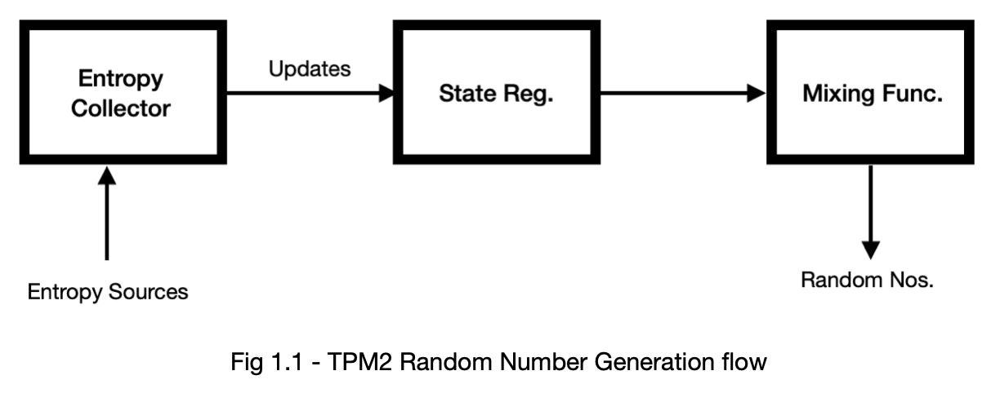
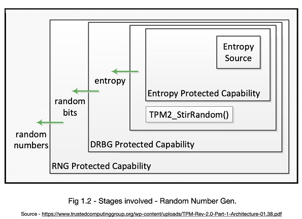
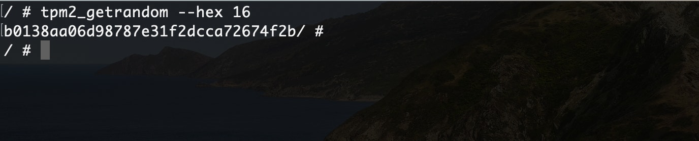
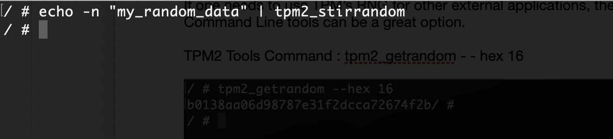

 <h1>1. Introduction</h1> 

Among other features, Trusted Platform Modules (TPM) comes with a True Random Number Generator (TRNG) that can be used for various applications including cryptographic purposes.This RNG module serves as the source for randomness for the TPM 2.0 Chip. 

A RNG module in TPM2 will typically contain the following - 
<ol>
<li>An entropy source and collector</li>
<li>State Register</li>
<li>A mixing func.
</ol>

There can be two types of calls to the TPM’s Random Number Generator, Internal call and External Call. RNG is capable to provide enough randomness for all the internal calls made. As well as, RNG is capable of providing 32 octets of randomness as per the specification to an external call.Another thing to note here is, each call made to the RNG produces a new value irrespective of the type of call. 

 
<h3>1.1 The source of Randomness </h3>

 The source of entropy in the TPM is the entropy collector. As the name suggests, entropy collector collects entropy from entropy sources and also removes bias. 

A TPM2.0 has at least one internal source of entropy. These sources can include noise, clock variations, air movement amongst other events. As depicted in Fig 1.1 the entropy collector provides input to the State Register.

<h3>1.2 Stages involved</h3>

Various algorithms and process supported by TPM calls RNG for unpredictable numbers, which is actually obtained from “RNG Protected Capability”. 

The “Deterministic Random Bit Generator (DRBG) Protected Capability“ obtains entropy from “Entropy Protected Capability”. Along with Entropy Protected Capability, TPM2_StirRandom() can also gather entropy from other entropy sources within the same TPM.

<h1>2. Random Numbers via TPM2 Tools</h1>

If one needs to use TPM’s RNG for other external applications, then TPM2 Tools Command Line tools can be a great option. 

TPM2 Tools Command : <code> tpm2_getrandom - - hex 16 </code>

<code>-- hex  : Converts output to hexadecimal ,
 16    :  Size in bytes</code>

Now, if one wants to have additional randomness, TPM2 Tools provides a convenient utility for this purpose called *tpm2_stirrandom*. To inject entropy via TPM2_StirRandom() to “Entropy Protected Capability” , we can use some file or use stdin.

TPM2 Tools Command :<code> echo -n “some_random_data” | tpm2_stirrandom</code>

*Note : 128 bytes can only be injected using stdin at once through stirrandom()*

# 3. Conclusion

The TPM2 provides in a sense True Random Numbers for use. These unpredictable numbers are coming from a dedicated hardware, hence can be trusted to be given as input to Crypto Algorithms amongst other applications. TPM2 also uses this for its internal use, and TCG claims it to be as secure as the strongest algorithm that TPM supports. Also, using the RNG is pretty straight forward via TPM2 Tools.
